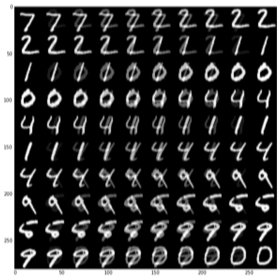
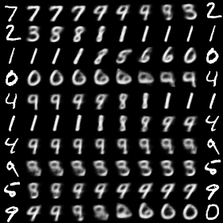
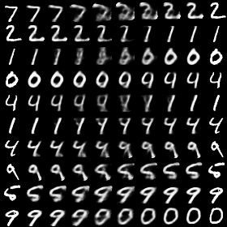

## Interpolation in image space vs latent space

### interpolation in mixup vs latent space

MIXUP             |  DIM2 |  DIM256 
:-------------------------:|:-------------------------:|:-------------------------:
  |   |   

## CIFAR-10

The following table shows the median test errors of the last 10 epochs in a 200-epoch training session. (Please refer to Section 3.2 in the paper for details.)

| Model              | weight decay = 1e-4  | weight decay = 5e-4  |
|:-------------------|---------------------:|---------------------:|
| ERM                |               5.53%  |               5.18%  |
| _mixup_            |               4.24%  |               4.68%  |
| _mixup_latent_     |               3.55%  |                |

